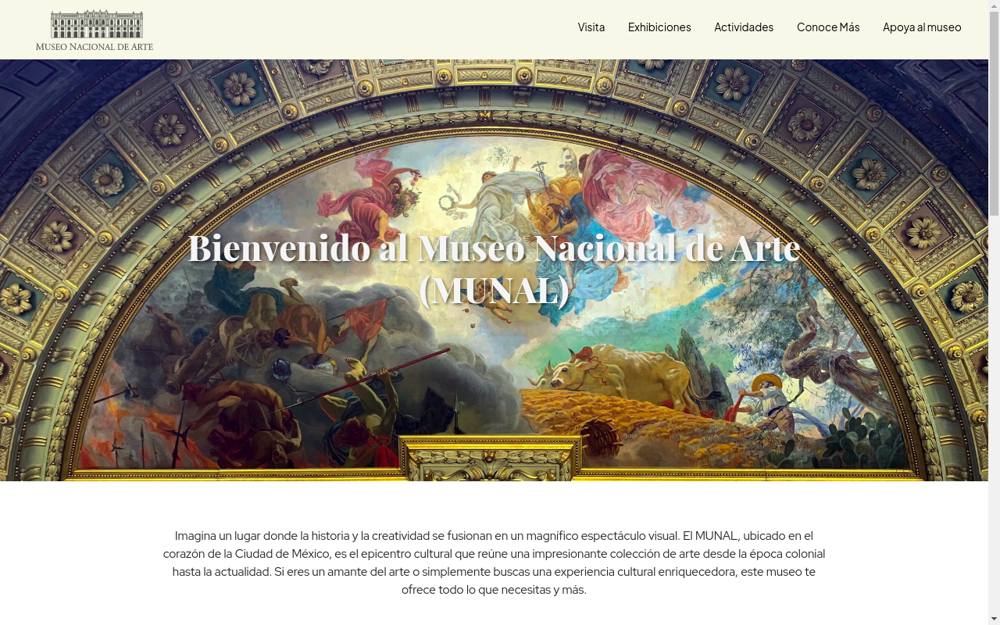
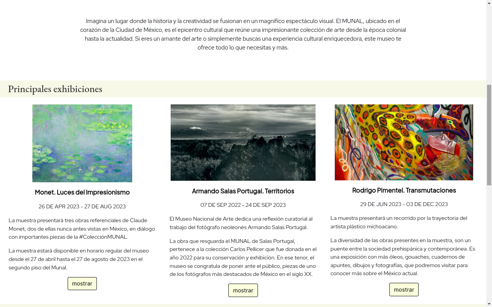
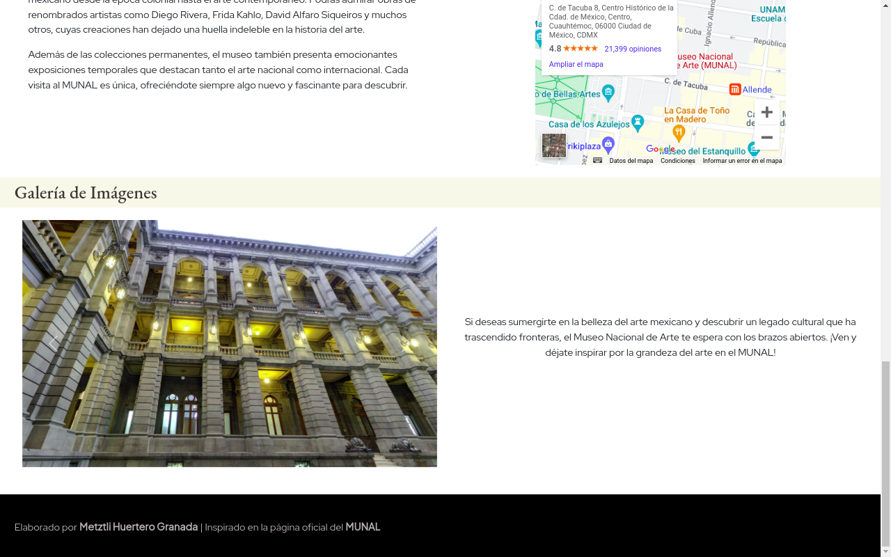

# Bienvenido al repositorio: Mujer Digital

En este repositorio, podrá encontrar el proyecto final de la etapa *"Introducción al Coding"* del programa **Mujer Digital**, una iniciativa de Junior Achievement, el cual consiste en la integración de conceptos, etiquetas y elementos HTML, propiedades CSS y código JavaScript para la implementación de botones, un carrusel de imagenes y el framework Bootstrap.

